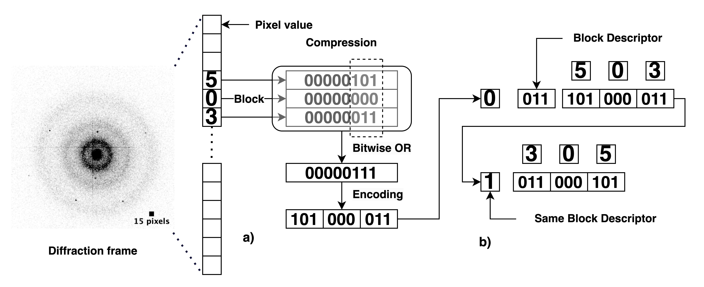

##  TERSE/PROLIX (TRPX) C++ Fast and Lossless Diffraction (cryo-EM) Data Compressor

___


TRPX is an *efficient compression and decompression* algorithm for *diffraction data* 

---

**TRPX achieves at least 85% reduction in diffraction data  file size while processing up to 2000 512 * 512 frames/s**.
>It allows efficient and fast compression of integral diffraction data and other integral grey scale
data *(cryo-EM)* into a Terse object that can be decoded by the member function Terse<T>::prolix(iterator). The
prolix(iterator) member function decompresses the data starting at the location defined by 'iterator'
(which can also be a pointer). A Terse object is constructed by supplying it with uncompressed data or a
stream that contains TRPX data.
> 
> 

## How to compile and run it

___

    git clone git@github.com:Senikm/trpx.git 
> Navigate to the project directory
```cmake

    mkdir build
    cd build
    cmake ..
    make 
```
---

### Running compression and decompression


> Compression
``` c++

    ./terse *                   // all tiff files in this directory are compressed to trpx files 
    
    ./terse ˜/dir/frame*.tiff  // compresses all tiff files in the directory ~/dir that start with frame\n"
    
    ./terse -help              // All available options will be printed
``` 

> Decompression

```c++
    ./prolix *                  // all trpx files are expanded to tiff files

    ./prolix ˜/dir/frame*.trpx   // expands all trpx files in the directory ~/dir that start with frame\n"


```

---

## Documentation

[](https://senikm.github.io/trpx/)

---

## Fiji/ImageJ plugin for .trpx format files


> For compilation, use the java version that came with Fiji, to ensure java compatibility. Also make sure the ij-1.??.jar package is included in the compilation:
> For example, compile with:


    Applications/Fiji.app/java/macosx/zulu8.60.0.21-ca-fx-jdk8.0.322-macosx_x64/jre/Contents/Home/bin/javac -cp /Applications/Fiji.app/jars/ij-1.53t.jar TRPX_Reader.java

> Then create the .jar files with:

    Applications/Fiji.app/java/macosx/zulu8.60.0.21-ca-fx-jdk8.0.322-macosx_x64/jre/Contents/Home/bin/jar -cvf Terse_Reader.jar TRPX_Reader*.class

> Then copy Terse_Reader.jar to the "plugins" directory of Fiji:

    cp TRPX_Reader.jar /Applications/Fiji.app/plugins/.

> Then restart Fiji, and Terse Reader is in the plugins menu.

---
## Citation

**If you use our software in your research, please cite our paper using the following BibTeX entry**:

```bibtex
@article {Matinyan:lu5031,
    author = "Matinyan, Senik and Abrahams, Jan Pieter",
    title = "{{TERSE/PROLIX} ({TRPX}) -- a new algorithm for fast and lossless compression and decompression of diffraction and cryo-EM data}",
    journal = "Acta Crystallographica Section A",
    year = "2023",
    volume = "79",
    number = "6",
    pages = "",
    month = "Nov",
    doi = {10.1107/S205327332300760X},
    url = {https://doi.org/10.1107/S205327332300760X},
    keywords = {compression, TERSE/PROLIX, TRPX, lossless, diffraction data, cryo-EM data, lossless data compression},
}
```
---
## Test dataset

Explore our test dataset [here.](https://drive.google.com/drive/folders/16UVHtia6GAK9WFO3RtO32tImhSlgdxEd?usp=sharing)


---